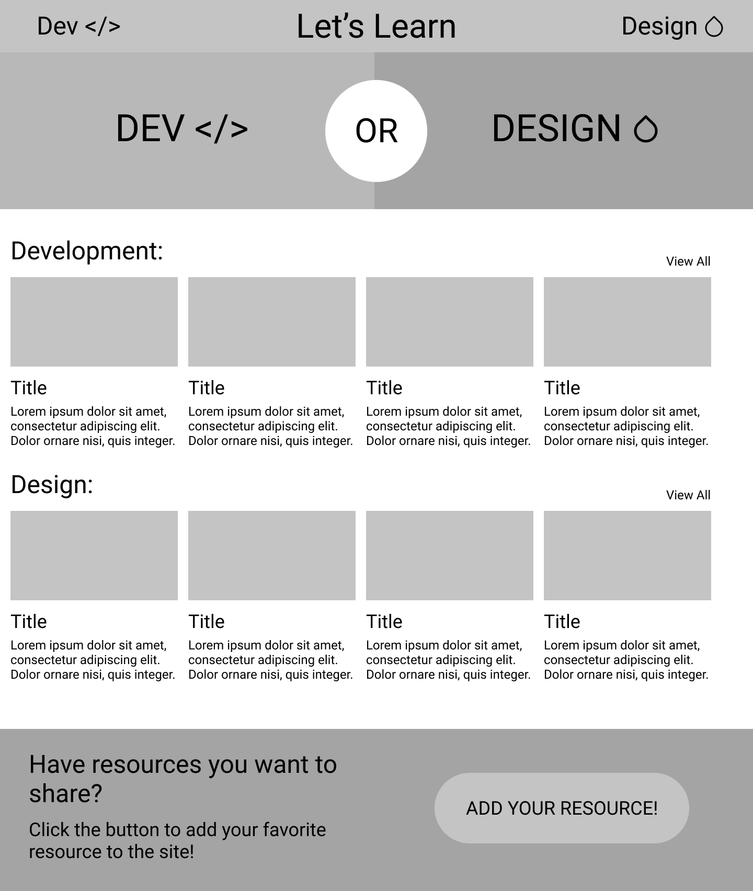
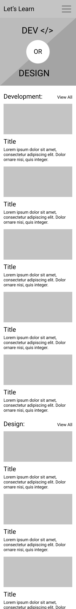

# Let's Learn Frontend
###### Author: Matt Czencz

## Live Link:
[View live version here](https://czencz-lets-learn.netlify.app/)

## Technologies Used
* react
* react-router-dom
* SASS
* [React Bootstrap](https://react-bootstrap.github.io/)
* [React Icons](https://react-icons.github.io/react-icons)
* Images from [Unsplash](https://unsplash.com/)
* Google Fonts

## Wireframes
#### Desktop Wireframe:

#### Mobile Wireframe:

